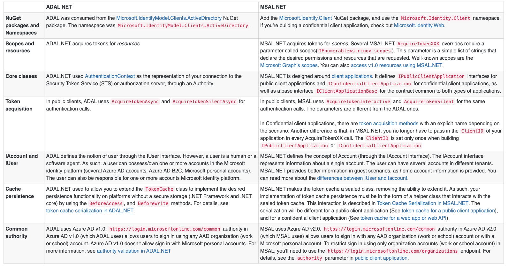
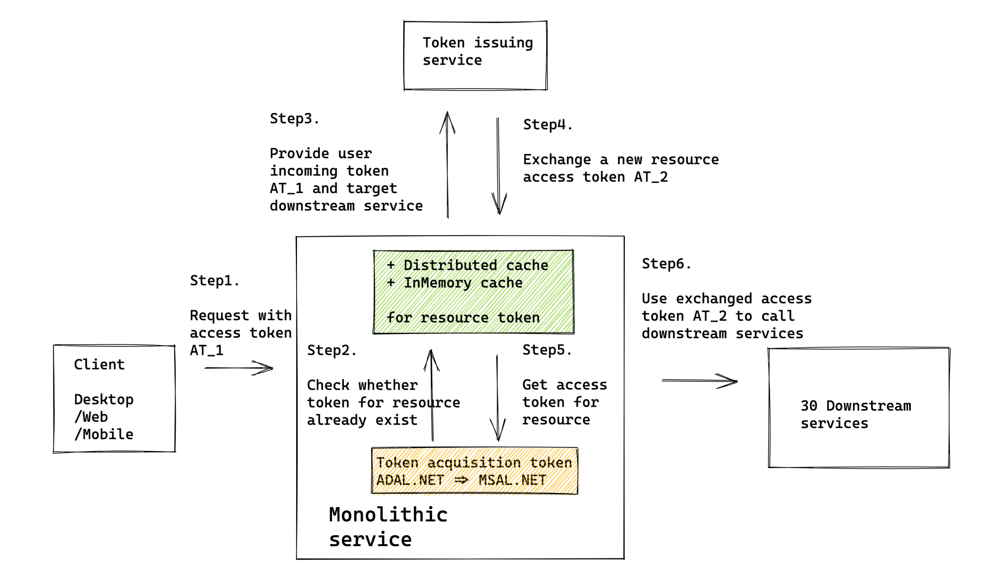

- [Token acquisition library migration](#token-acquisition-library-migration)
  - [Motivation](#motivation)
  - [Success matrix](#success-matrix)
  - [Project scope](#project-scope)
- [References](#references)

# Token acquisition library migration
## Motivation
* Migrate from [ADAL.Net](https://github.com/AzureAD/azure-activedirectory-library-for-dotnet) to [MSAL.Net](https://github.com/AzureAD/microsoft-authentication-library-for-dotnet)

## Success matrix

| `MSAL benefit` | `Decision` | `Measurement` |
|--|--|--|
| [Security] ADAL.NET support deprecation in June 2022 | Needed | A central dashboard showing services still using ADAL.NET |
| [Resiliency] Proactively refresh token (usually valid for 24h) in background 8h before expiration | Need | Telemetry around token lifetime |
| [Resiliency] Regional token issuing service support | Take as a follow-up item | NA |
| [Resiliency] Fallback service for extending token lifetime in case of token service outage  | Get automatically, only telemetry needed | NA |
| [Performance] Improvemnt gains against ADAL.NET | Get automatically / with best practices | Perf or load testing, CPU, latency monitor |
| [Security] Proof of possession token minting | Not needed | NA |
| [Security] Dynamic consent | Not needed | NA |
| [Telemetry] Enrich token fetch telemetry | Nice to have | NA |

## Project scope

# References
* https://medium.com/@chamod.14_80003/token-caching-wso2-api-manager-5c5b3d6ddd09
* https://www.pingidentity.com/en/company/blog/posts/2021/ultimate-guide-token-based-authentication.html

* [Protecting Server Resources Hosting Unauthenticated APIs](https://medium.com/@robert.broeckelmann/protecting-server-resources-hosting-unauthenticated-apis-d77875db7b8)
* [Who Owns API Security, and How Much Security Is Enough?](https://medium.com/@robert.broeckelmann/nissan-leaf-api-security-who-owns-api-security-and-how-much-security-is-enough-fa467fdb59a1)
* [DSig Part 1: XML Digital Signature and WS-Security Integrity](https://medium.com/@robert.broeckelmann/dsig-part-1-xml-digital-signature-and-ws-security-integrity-225ea3eb894e)
* [DSig Part 2: JSON Web Signature (JWS)](https://medium.com/@robert.broeckelmann/dsig-part-2-json-web-signature-jws-f428d0b5ae40)
* [DSig Part 3: XML DSig vs. JSON Web Signature](https://medium.com/@robert.broeckelmann/dsig-part-3-xml-dsig-vs-json-web-signature-709345c78541)
* [API Security vs. Web Application Security Part 1: A Brief History of Web Application Architecture](https://medium.com/@robert.broeckelmann/api-security-vs-web-application-security-part-1-a-brief-history-of-web-application-architecture-4c8a682a21e)
* [API Security vs. Web Application Security: Part 2](https://medium.com/@robert.broeckelmann/api-security-vs-web-application-security-part-2-e2f327b4b54c)
* [SAML 2.0 VS. JWT: UNDERSTANDING FEDERATED IDENTITY AND SAML](https://medium.com/@robert.broeckelmann/saml-2-0-vs-jwt-understanding-federated-identity-and-saml-a259dff8545c)
* [Delegation — A General Discussion](https://medium.com/@robert.broeckelmann/delegation-a-general-discussion-d0b2ab5a85c7)
* [OAuth2 Access Tokens vs API Keys — Using JWTs](https://medium.com/@robert.broeckelmann/oauth2-access-tokens-vs-api-keys-using-jwts-651f97df9e19)
* [OAuth2 Access Tokens and Multiple Resources Series](https://medium.com/@robert.broeckelmann/oauth2-access-tokens-and-multiple-resources-series-13e467861893)
* [Authorization Series](https://medium.com/@robert.broeckelmann/authorization-series-6b9c5890716c)
* [Active Directory Federation Services (ADFS) and Kerberos](https://medium.com/@robert.broeckelmann/active-directory-federation-services-adfs-and-kerberos-f36c71e13be5)
* [The Benefits of JWTs as OAuth2 Access Tokens](https://medium.com/@robert.broeckelmann/the-benefits-of-jwts-as-oauth2-access-tokens-6ec47dbd2783)
* [IDENTIVERSE REFLECTIONS: NEWS, TRENDS AND A GLIMPSE INTO THE FUTURE](https://medium.com/@robert.broeckelmann/identiverse-reflections-news-trends-and-a-glimpse-into-the-future-d585050b7cf5?readmore=1&source=user_profile---------20-------------------------------)
* [The Many Ways of Approaching Identity Architecture](https://medium.com/@robert.broeckelmann/the-many-ways-of-approaching-identity-architecture-813118077d8a)
* [A Brief Summary of All Things Apigee and API Management that I Have Written](https://medium.com/@robert.broeckelmann/a-brief-summary-of-all-things-apigee-and-api-management-that-i-have-written-46bb71c2d8b9)
* [Authentication vs. Federation vs. SSO](https://medium.com/@robert.broeckelmann/authentication-vs-federation-vs-sso-9586b06b1380)
* [What is Authorization?](https://medium.com/@robert.broeckelmann/what-is-authorization-9977caacc61e)
* [SAML2 vs JWT: A Comparison](https://medium.com/@robert.broeckelmann/saml2-vs-jwt-a-comparison-254bafd98e6)
* [How To Submit Your Security Tokens to an API Provider Pt. 1](https://medium.com/@robert.broeckelmann/how-to-submit-your-security-tokens-to-an-api-provider-pt-1-4a68df35843a)
* [JWT Use Cases](https://medium.com/@robert.broeckelmann/jwt-use-cases-bb94e4e70949)
* [Application Security Models](https://medium.com/@robert.broeckelmann/application-security-models-e5b47fe6ac70)
* [Identity Propagation in an API Gateway Architecture](https://medium.com/@robert.broeckelmann/identity-propagation-in-an-api-gateway-architecture-c0f9bbe9273b)
* [An Alternative to Delegated Access in the Enterprise](https://medium.com/@robert.broeckelmann/an-alternative-to-delegated-access-in-the-enterprise-82023ed423b5?source=user_profile---------63-------------------------------)
* [SAML2 vs JWT: Apigee & Azure Active Directory Integration — A JWT Story](https://medium.com/levvel-consulting/saml2-vs-jwt-apigee-azure-active-directory-integration-a-jwt-story-a3eb00769a1f)
* [Keeping Your APIs Secure for Multiple User Types](https://medium.com/@robert.broeckelmann/keeping-your-apis-secure-for-multiple-user-types-d5c627793c4c)
* [Sample: WSO2 EI Cache Mediator based Token Caching](https://medium.com/@chamilad/sample-wso2-ei-cache-mediator-based-token-caching-3036f2e7e6eb)
